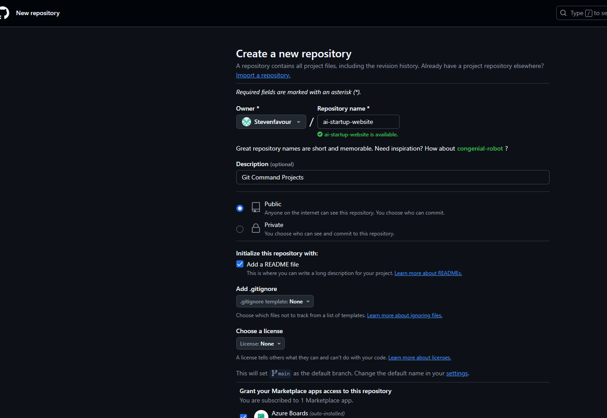
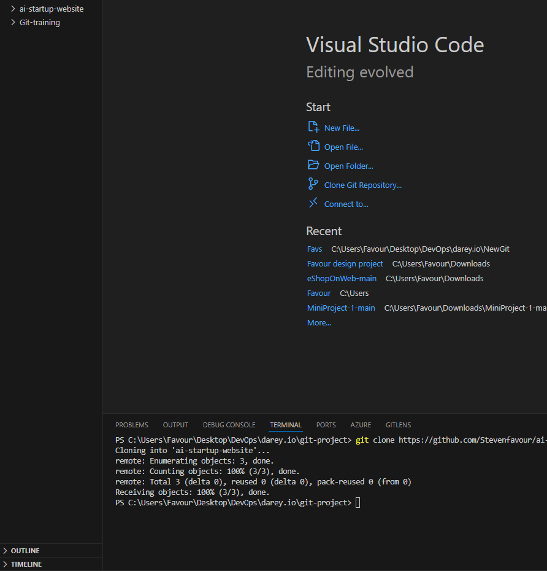
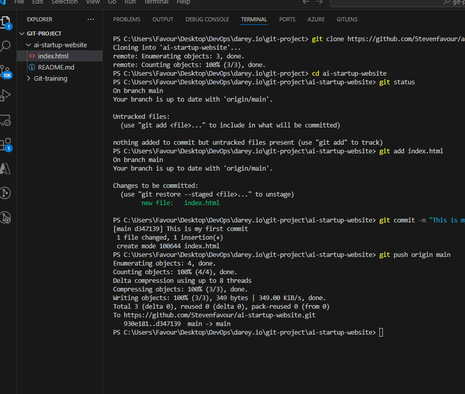
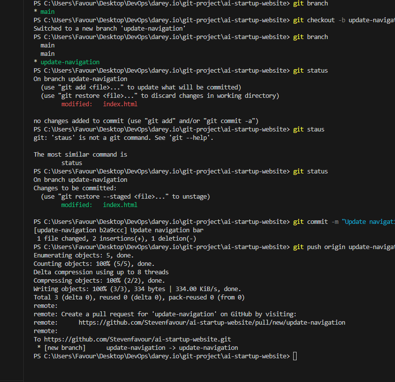
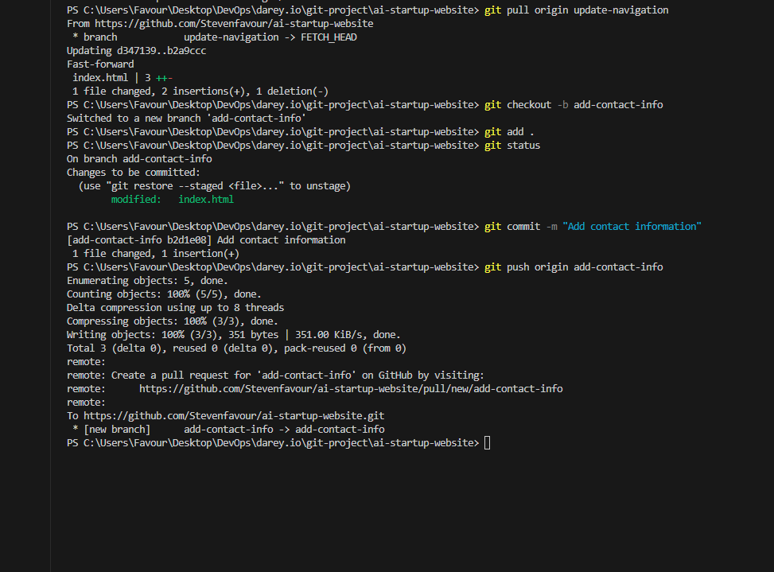

# ai-startup-website
Git Command Projects

## 1. New Repos creation in GitHub
Below shows a image of a new ai-startup-website repository being created.

## 2. Clone remote repository
Shows the cloning command of the previously created repos.

## 3. Working with Main Branch
On completeing the previous steps, A index.html was created inside the repository root folder and the default branch was set to main.

git status: To determine the status on the changes made in the current branch (main) 

git add . : To add the changes in preparation for commit.

git commit: To commit these changesto the branch.

git push: Push changes to the main branch of the remote repository.

## 4. Working with update-navigation Branch
Creating and switching to the update-navigation branch using the git checkout command.

## 5. Working with add-contact-info Branch
Creating and switching to the add-contact-info branch using the git checkout command and making changes respectively inside the index.html file

## 6. Merge requests

The image shows the merge requests from the update-navigation and add-contact-info branches to merge changes into the main branch on GitHub.

