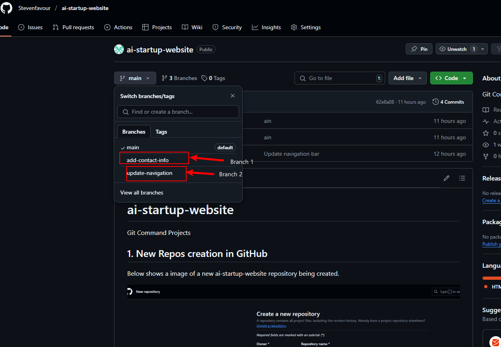
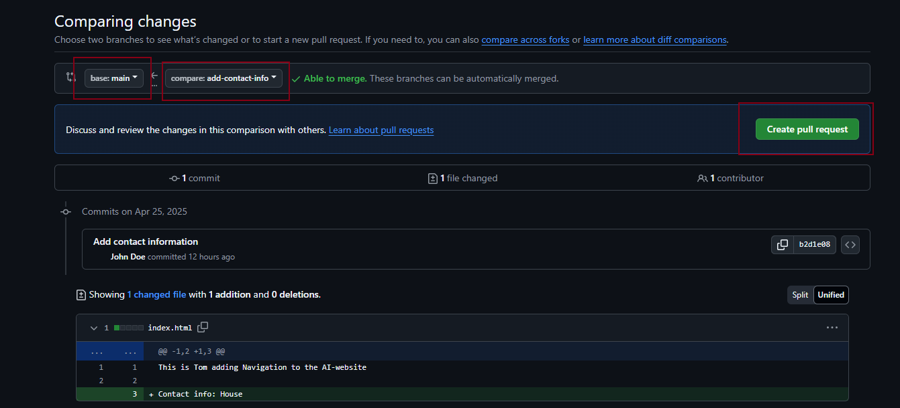
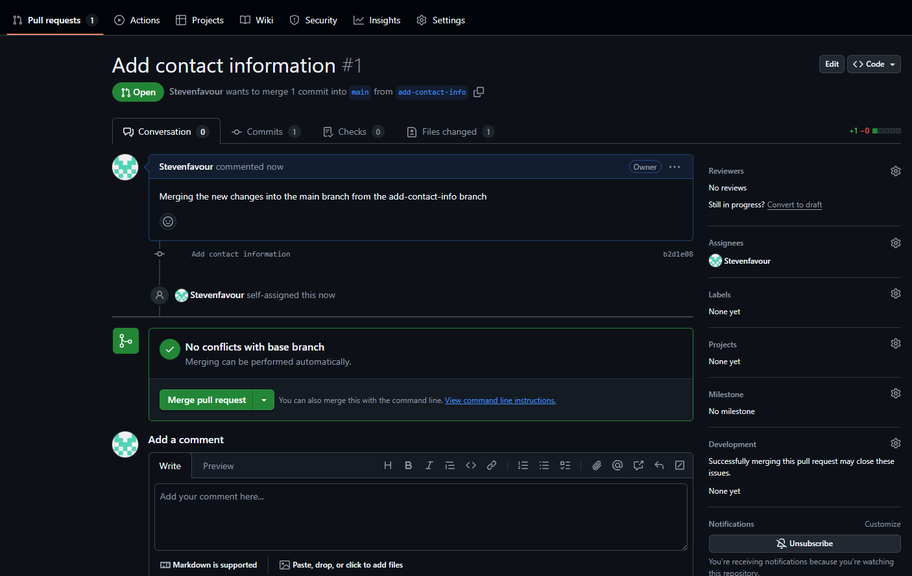
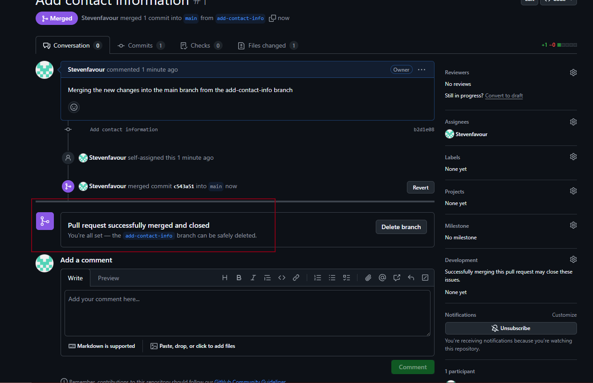
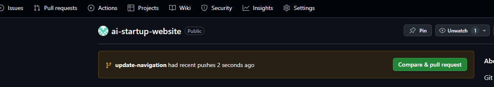
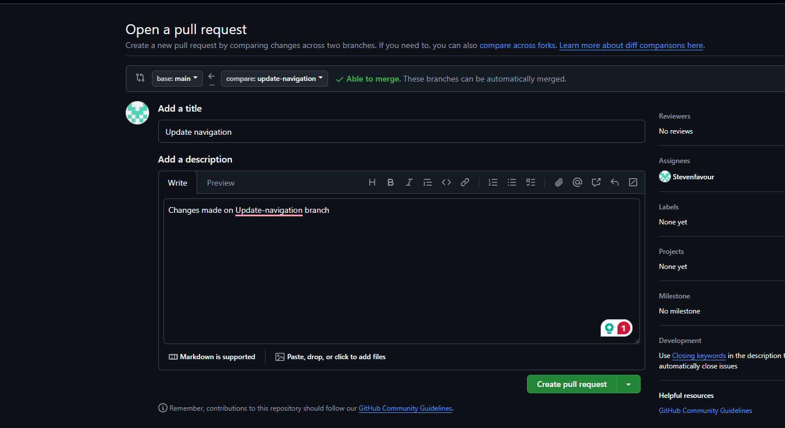

# ai-startup-website
Merging Changes

## 1. Branches to work with.
Below shows the image of the three branches that we are going to be working with in this project.

 ## 2. Working with the add-contact-info branch

 A pull request is created so as to merge the new changes to this branch into the main branch.

 

 

 After assigning myself as a reviewer, I then approved the pull request and merged the changes from the add-contact-info branch to the main branch.

 ## 2. Working with the update-navigation branch
 
 The image below shows the git commands to switch to this branch and also pulling and ensuring it is upto date with the mian branch so as to avoid conflict when pushing to the remote repos.

 

 Now that this branch is up to date with the main branches, changes were made to index.html file. Commits and push were made to the branch using the source control tab on VS CODE (not with git commands). A new pull request is then created so as to merge the changes into the main branch.

 

 

The image below comapared the changes that are about to the merged

 

 

 Below indicates a successful merge completed.

